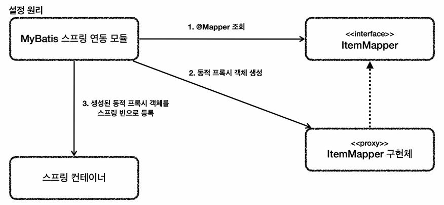

# MyBatis 적용3 - 분석

우리가 만든 `ItemMapper` 인터페이스는 구현체가 없을텐데 도대체 어떻게 동작할 수 있었을까요?

#### ItemMapper 인터페이스
```java
@Mapper
public interface ItemMapper{
    
    void save(Item item);
    
    void update(@Param("id") Long id, @Param("updateParam") ItemUpdateDto updateParam);
    
    List<Item> findAll(ItemSearchCond itemSearch);
    
    Optional<Item> findById(Long id);
    
}
```


그 [원리](#설정-원리)는 아래와 같습니다.

### 설정 원리


1. `@Mapper` 조회
- 애플리케이션 로딩 시점에 MyBatis 스프링 연동 모듈은 `@Mapper`가 붙어있는 인터페이스를 조사합니다.
2. 동적 프록시 객체 생성
- 해당 인터페이스가 발견되면 동적 프록시 기술을 사용하여 `ItemMapper` 인터페이스의 구현체를 만듭니다.
3. 생성된 동적 프록시 객체를 스프링 빈으로 등록
- 생성된 구현체를 스프링 빈으로 등록합니다.


### 매퍼 구현체
동적 프록시로 생성되어 스프링 빈으로 등록되는 `Mapper 구현체` 덕분에 여러가지가 가능해집니다.
- 인터페이스만 만들어줘도 편리하게 마이바티스를 사용할 수 있습니다.
- 원래 마이바티스를 사용하려면 더 번잡한 코드를 거쳐야 하는데, 이런 부분을 인터페이스 하나로 매우 깔끔하고 편리하게 사용할 수 있습니다.
- 이 매퍼 구현체는 예외 변환까지 처리해줍니다. 마이바티스에서 발생한 예외를 스프링 예외 추상화인 `DataAccessException`에 맞게 변환해서 반환합니다. 

> **참고**
> <br/>
> 마이바티스 스프링 연동 모듈이 자동으로 등록해주는 부분은 `MyBatisAutoConfiguration` 클래스를 참고.