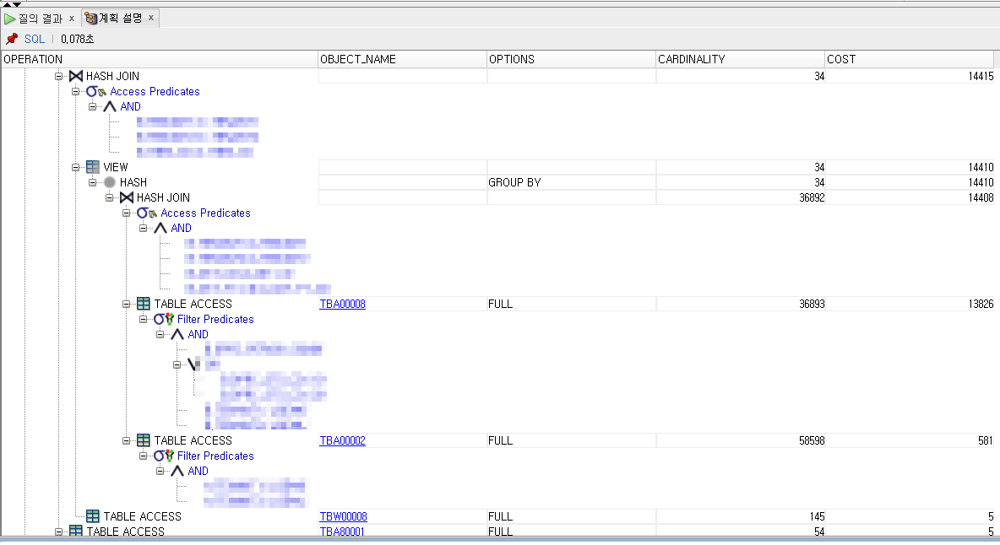

# 2.14

1. [MyBatis Query timeout 설정](#mybatis-query-timeout-설정)
2. [DB 실행 계획](#db-실행-계획)

## MyBatis Query timeout 설정

### 배경
> Cause: java.sql.SQLTimeoutException: ORA-01013: 사용자가 현재 작업의 취소를 요청했습니다.

특정 화면에서 조회를 할 때 위와 같은 `SQLTimeoutException` 에러가 발생하여 이에 대한 원인을 찾고 해결해야 했습니다.

### 원인 
`SQLTimeoutException`이 발생한 쿼리를 DBMS에서 따로 실행해보니 30초 넘게 걸리는 걸 확인하였습니다.
선배님께 여쭤본 결과 Timeout이 30초로 설정되어 있어 해당 Exception이 발생했을 거라고 하셨고, 확인 결과 실제로 그랬습니다.

#### MyBatis 설정
```xml
<configuration>
    <settings>
        <!-- 데이터베이스로의 응답을 얼마나 오래 기다릴지를 판단하는 타임아웃을 설정 -->
        <setting name="defaultStatementTimeout" value="30" />
    </settings>
</configuration>
```

### 해결 
전체 설정인 `defaultStatementTimeout`을 바꿀 순 없었기에 해당 쿼리에만 `timeout` 속성을 따로 주어 해결하였습니다.
```xml
1. 변경 전
<select id="" paramterType="" resultType="">
    SELECT ...
</select>

2. 변경 후 (45초로 설정)
<select id="" paramterType="" resultType="" timeout="45">
...
</select>
```

### timeout 설정 시 주의사항
다만 `timeout` 시간을 무작정 늘릴 수는 없었습니다.
클라이언트의 대기 시간을 늘린다는 것도 이유지만, 더 큰 이유는 해당 쿼리가 속한 서비스 로직의 `timeout` 시간도 고려해야 됐기 때문입니다.

해당 쿼리를 `A`라고 한다면 또 다른 쿼리 `B`와 함께 하나의 서비스 로직 `selectXxx`에 포함되어 있었고, 이 `selectXxx`은 하나의 `트랜잭션`이었기 때문입니다.

`select*`, 즉 접두사 select로 시작하는 메서드의 경우 트랜잭션의 `timeout`이 120초로 설정되어 있었는데요. 
그래서 60초 혹은 그 이상의 응답 대기시간을 부여한들 트랜잭션에서 에러가 발생할 여지가 있었습니다. (e.g. `TransactionTimedOutException`)

#### Transaction 설정
```xml
<tx:advice id="txAdvice" trasaction-manager="txManager">
    <tx:attributes>
        <tx:method name="select*" read-only="true" propagation="SUPPORTS" timeout="120" />
    </tx:attributes>
</tx:advice>
```

### Reference
- `defaultStatementTimeout` : https://mybatis.org/mybatis-3/ko/configuration.html
- `TransactionTimedOutException` : https://docs.spring.io/spring-framework/docs/current/javadoc-api/org/springframework/transaction/TransactionTimedOutException.html
- https://tlatmsrud.tistory.com/44

---


## SQL 튜닝을 위한 DB 실행 계획
허나 `timeout`을 늘려서 해결한 것은 일차적인 해결이라고 생각했습니다.
클라이언트 입장에서 보면 1~5초도 굉장히 긴 시간이기 때문입니다.
결국 SQL 튜닝이 필요하다고 생각됐고, 이를 위해 DB 실행 계획을 봤습니다.

### 실행 계획 결과
1. `INDEX`를 전혀 타지 않고 `FULL SCAN` 되고 있는 문제
2. 심지어 `CARDINALITY`는 3~5만...
3. `ORDER BY` 절 

위와 같은 이유로 쿼리가 오래 걸리는 걸 확인했습니다.



### 해결
2.15

### Reference
-  DB 실행 계획 해석 방법 : https://coding-factory.tistory.com/744