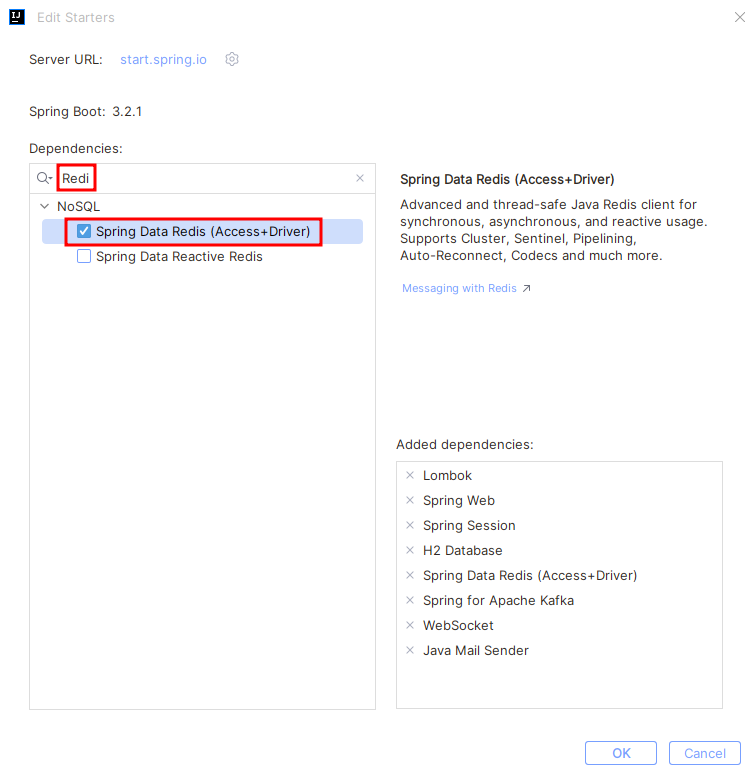
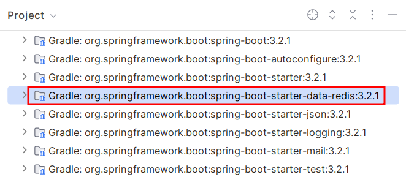
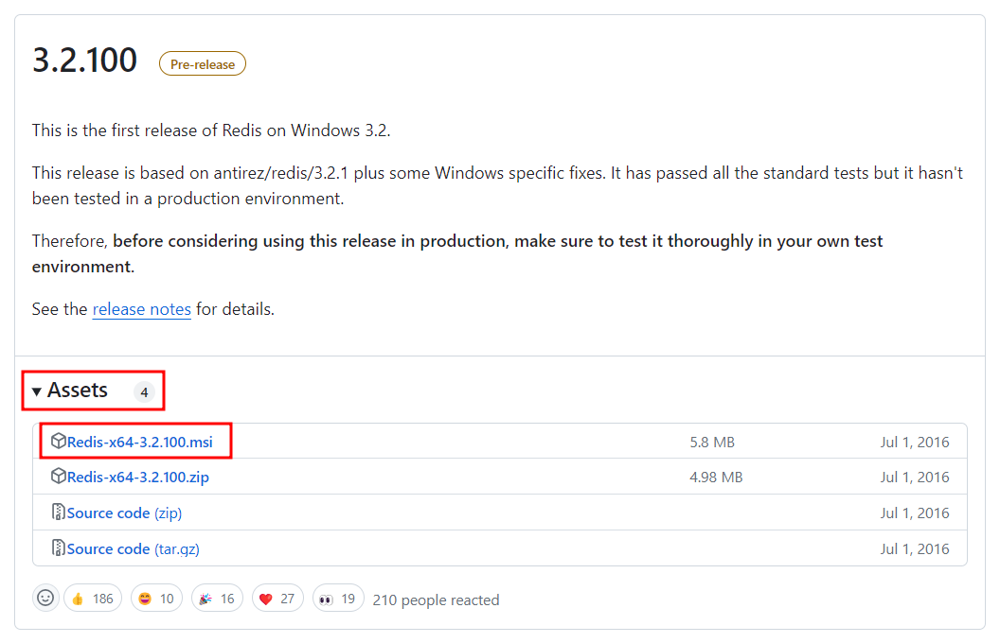
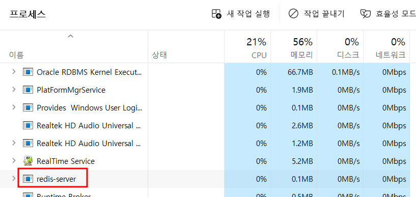
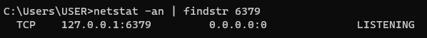
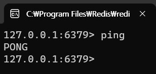

# Redis 설치부터 사용 방법까지

이 글은 Spring Boot 3.2.1 버전을 기준으로 작성되었으며, Spring Boot에서 Redis를 사용하는 방법에 대해 다룹니다.

## 목차
1. [Redis 의존성 추가](#1-redis-의존성-추가)
2. [Redis 설치 및 실행](#2-redis-설치-및-실행)
3. [Redis 설정](#3-redis-설정)
4. [Redis 사용 예시 코드](#4-redis-사용-예시-코드)

---

## 1. Redis 의존성 추가
스프링 부트에서 Redis를 사용할 수 있게 먼저 의존성을 추가합시다.



의존성을 추가하면 `build.gradle`에 아래와 같은 코드가 추가됩니다.
```groovy
implementation 'org.springframework.boot:spring-boot-starter-data-redis'
```

추가한 후에 `External Libraries`에서 어느 버전의 Redis를 설치해야 하는지 알아봅시다. 
`:` 뒤에 붙은 숫자를 보면 되므로 우리는 `3.2.1` 버전을 설치하면 됩니다. 
(우리 프로젝트의 스프링 부트 버전이 `3.2.1` 버전이라 그런 것 같습니다.)



## 2. Redis 설치 및 실행
### (1) 설치
Redis 다운로드 사이트 : https://github.com/microsoftarchive/redis/releases

`3.2.1` 버전을 찾고 `Assets 화살표`를 누른 다음, `Redis-x64-3.2.100.msi`를 설치하면 됩니다. <br/>
`Next`만 누르면서 설치하셔도 무방합니다. (port 번호 `6379`인지만 확인)


### (2) 실행
실행 중인지 확인하기 위해 작업관리자나 `6379` 포트가 `Listening` 중인지 확인해 줍시다.
#### 1) 작업관리자


#### 2) `6379` 포트가 `Listening` 중인지 확인
CMD 창을 켜고 `netstat -an | findstr 6379` 을 입력하여 아래와 같이 LISTENING 이라는 문구가 뜨는지 확인해 줍시다. 떴다면 설치가 잘 된 것입니다.



<br/>
실행된 걸 확인했다면 설치경로로 들어가 `redis-cli.exe`를 실행시켜 봅시다.
`ping`을 입력했을 때 'PONG'이 응답으로 오면 잘 작동되는 것입니다.



혹시나 실행이 안됐다면 `redis-server.exe`로 직접 실행하면 되겠습니다.


## 3. Redis 설정
```groovy
# application.yml
spring:
  data:
    redis:
      host: localhost
      port: 6379
```

스프링 부트 2.0 버전 이상은 위와 같이 설정만 해줘도 되지만, 그 아래 버전은 RedisConnectionFactory, RedisTemplate, StringRedisTemplate 등에 대한 설정을 추가로 해줘야 합니다. (2.0 이상 버전에서는 AutoConfiguration이 이 작업을 대신해준다고 합니다.)

만약 스프링 부트 2.0 이하 버전이라면 아래의 설정을 추가해주도록 합시다. (저희는 할 필요 없습니다.)
```java
@Configuration
@RequiredArgsConstructor
@EnableRedisRepositories // Redis를 사용한다고 명시해주는 애노테이션
public class RedisConfig {

    private final RedisProperties redisProperties; // Redis 서버와의 연결 정보를 저장하는 객체

    @Bean
    public RedisConnectionFactory redisConnectionFactory(){
        return new LettuceConnectionFactory(redisProperties.getHost(), redisProperties.getPort());
    }

    // RedisTemplate
    @Bean
    public RedisTemplate<String, Object> redisTemplate(){
        RedisTemplate<String, Object> redisTemplate = new RedisTemplate<>();

		redisTemplate.setConnectionFactory(redisConnectionFactory());
        redisTemplate.setKeySerializer(new StringRedisSerializer());
        redisTemplate.setValueSerializer(new StringRedisSerializer());

        return redisTemplate;
    }

    // StringRedisTemplate
    @Bean
    public StringRedisTemplate stringRedisTemplate() {
        StringRedisTemplate stringRedisTemplate = new StringRedisTemplate();
        
        stringRedisTemplate.setConnectionFactory(redisConnectionFactory());
        stringRedisTemplate.setKeySerializer(new StringRedisSerializer());
        stringRedisTemplate.setValueSerializer(new StringRedisSerializer());
        
        return stringRedisTemplate;    
    }
}
```


## 4. Redis 사용 예시 코드
이제 본격적으로 코드를 작성하여 스프링 부트에서 Redis를 사용해보겠습니다. 

저희는 현재 `Spring Data Redis`를 이용하여 Redis DB를 이용하고 있는데요. 
이 `Spring Data Redis`는 Redis에 대한 2가지 접근 방식을 제공합니다.

하나는 제가 사용한 `RedisTemplate`을 이용한 방식이며, 다른 하나는 `RedisRepository`를 이용한 방식입니다.
(이번 글에서는 `RedisTemplate` 방식에 대해서만 다루고 있습니다. `RedisRepository` 방식도 궁금하다면 다음 [링크](https://wildeveloperetrain.tistory.com/32)를 참고해주세요.)

`RedisTemplate` 객체 외에도 `StringRedisTemplate`도 있는데요. 
저희는 `StringRedisTemplate`을 주로 사용할 것 같습니다.
- [차이점 알아보기](#redistemplate-vs-stringredistemplate)
- [(String)RedisTemplate 객체에 대하여](#2-stringredistemplate-객체에-대하여)


### StringRedisTemplate을 사용한 테스트 코드
`(String)RedisTemplate`을 이용하면 Redis DB에 대한 CRUD 작업을 할 수 있습니다.
```java
@Slf4j
@SpringBootTest
public class RedisServiceTest_v2 {

    @Autowired
    StringRedisTemplate stringRedisTemplate;

    static final String KEY = "테스트 키";
    static final String VALUE = "테스트 값";
    static final Duration DURATION = Duration.ofSeconds(5); // 5초

    @Test
    @DisplayName("StringRedisTemplate을 사용하여 Redis에 데이터가 제대로 저장되는지 확인합니다.")
    void stringRedisTemplateTest() throws InterruptedException {
        ValueOperations<String, String> values = stringRedisTemplate.opsForValue();
        
        // Redis에 데이터 저장
        values.set(KEY, VALUE, DURATION);

        // Redis에 저장된 데이터 불러오기
        String value = values.get(KEY);
        log.info("value={}", value); // 테스트 값

        // Duration이 지난 데이터 불러오기
        Thread.sleep(6000);
        String value2 = values.get(KEY);
        log.info("value2={}", value2); // null
    }
}
```

### RedisTemplate VS StringRedisTemplate
#### 1) 차이점
1줄 요약 : `StringRedisTemplate` == `RedisTemplate<String, String>`이라고 해도 무방할 것 같습니다. (String 타입의 제네릭을 곁들인...)

```java
// StringRedisTemplate
ValueOperations<String, String> values = stringRedisTemplate.opsForValue();
values.set(KEY, VALUE, DURATION);

// RedisTemplate
ValueOperations values = redisTemplate.opsForValue(); // 직접 key, value 타입을 지정해줄 수 있습니다.
values.set(KEY, VALUE, DURATION);
```
제네릭으로 `key`, `value`에 대한 타입을 `String`으로 지정하였기에 불필요한 타입 캐스팅을 줄이고, 코드 가독성 측면에서도 좀 더 유리해 보입니다.

#### 2) (String)RedisTemplate 객체에 대하여
[공식 문서](https://docs.spring.io/spring-data/redis/docs/current/api/org/springframework/data/redis/core/RedisTemplate.html#preProcessConnection(org.springframework.data.redis.connection.RedisConnection,boolean))
- Redis 데이터에 접근하도록 도와주는 헬퍼 객체
- 자바 객체 <-> binary data 간의 `직렬화/역직렬화`를 자동으로 해줌)
- `String` 타입을 주로 사용한다면 `StringRedisTemplate` 사용을 고려
- 한번 설정이 완료됐다면, `thread-safe`


## Reference
- https://docs.spring.io/spring-data/redis/docs/current/api/org/springframework/data/redis/core/RedisTemplate.html#preProcessConnection(org.springframework.data.redis.connection.RedisConnection,boolean)
- https://docs.spring.io/spring-data/redis/docs/current/api/org/springframework/data/redis/core/StringRedisTemplate.html
- https://oingdaddy.tistory.com/225
- https://green-bin.tistory.com/69
