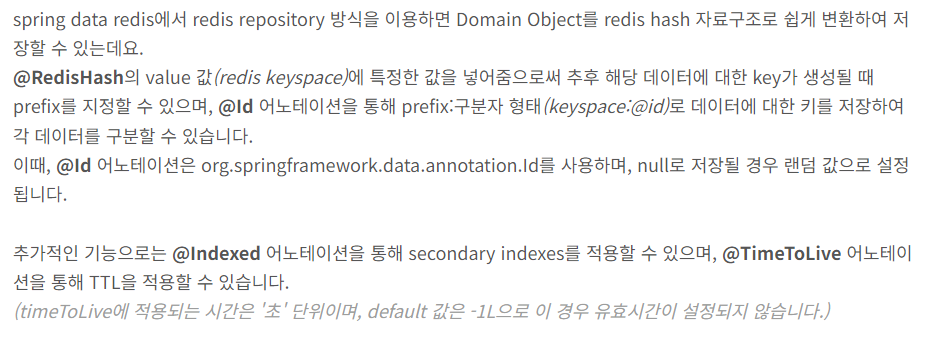

1. Repository 이용해서 코드 짠 걸 쭉 보여주고
2. 문제점이 뭐였고, 그걸 어떻게 해결했는지
- 문제점 : 
  - pk 값이 있긴 한데, 그걸 클라이언트한테 주기가 좀 그래서.. 유저의 mail을 Secondary Index로 써야 했다는 점.
  - @Indexed를 쓰면 되긴 해.. 근데 이건 Spring Data Redis꺼라서 저 데이터가 지워지지 않는다는 점. -> keyspace ~~로 해결 

3. 그러나 그럼에도 불구하고 문제점 
- 아니 이럴바엔 그냥.. RedisTemplate 사용하는게 더 낫겠다는 결론에 도달하기까지
- 구현도 쉽고, 나름 조작도 쉽고 (아니 심지어 둘 다 spring.data.redis.core 라는 같은 패키지에 있는 놈이네??)
- https://github.com/spring-projects/spring-data-redis/tree/main/src/main/java/org/springframework/data/redis/core

4. 결국은 key-value DB인 Redis에 대한 이해가 부족한 상태였다는 점과
5. Spring Data 프로젝트 이놈들 특징이 String id, Long id 이런 식으로 PK를 그냥 id라고 퉁치는데, 이게 좀 살짝 열받네?
---

** 둘다 Spring Data Redis를 쓴 거임.
- 근데 이제 API를 다른 걸 쓴거지. 엄밀히 말해서


나랑 비슷하게 2가지 방식 소개한 사람
https://wildeveloperetrain.tistory.com/244
> spring boot에서 인메모리 데이터 저장소인 redis를 사용하기 위해서는 org.springframework.data.redis.core 패키지에 있는 'RedisTemplate 클래스를 사용하는 방법'과 CrudRepository를 상속받는 'RedisRepository를 사용하는 방법'이 있는데요.


## 1번째 방식 - `Repository??`

처음에는 이런 식으로 썼음.
```java
@Getter
@RedisHash(value = "Authentication", timeToLive = 5)
public class Authentication{
    @Id 
    private String id;
    private String authCode;
    private String mail;
}
```
```java
public interface RedisRepository extends CrudRepository<Authentication, String> {
    Authentication findByAuthCode(String authCode);
}
```
`findByAuthCode` : 유저가 입력한 인증코드(authCode)로 인증 여부를 체크하기 위해 추가

위 메서드를 만들고 테스트 코드를 실행하니까 null이 나오는 거야 자꾸. 분명 인증코드를 잘 입력했는데

그래서 알아보니까 key-value DB인 Redis라서 value(authCode, mail)를 찾으려면 key(id)값으로만 찾을 수 있었던 거임. 
이걸 해결하기 위해서 막 찾아보니까 @Indexed 라는 어노테이션에 대해 알게 됨.
그래서 아래와 같이 코드를 짰음.

```java
@Getter
@RedisHash(value = "Authentication", timeToLive = 5)
public class Authentication {
    @Id 
    private String id; 

    @Indexed 
    private String authCode;

    private String mail;
}
```

`@Indexed` : Secondary Indexes의 역할을 하도록 하는 역할. 필요 시 이 값으로 데이터를 조회하기 위해 인덱싱을 해주는 것이다.

이 어노테이션을 붙이고 나니까 `findByAuthCode`로 기능 구현이 가능해졌음.

---

### `@Indexed`?? `@TimeToLive`??의 문제점 (다시 찾아보기)
근데 이 어노테이션들에 대해 더 알아보니까 문제 될 소지가 몇 가지 있었음.

보조 인덱스 관련 값들이 남아있는 문제
- https://dkswnkk.tistory.com/709

TimeToLive의 문제점
- https://hyperconnect.github.io/2022/12/12/fix-increasing-memory-usage.html

### 해결방법
Redis의 Key Space Notifications 기능을 활용하면, TTL이 만료되는 시점에 이벤트를 감지하고, 보조인덱스를 삭제할 수 있습니다.
(이 어노테이션을 Configuration에 붙인다는데, 난 어디다가 붙여야 돼??)

(사실 테스트를 제대로 해본게 아니라서 테스트 마저 더 해보고 글 이어쓰기)
- 일단 postman으로 테스트 진행했고
- (1) @Id만 있을 때는 TTL 지나면 확실히 지워지는 거 목격함
- (2) @Indexed도 있을 때는 TTL 지나도 계속 더미 데이터가 남아있는데... (그 어노테이션이 제대로 적용 안된듯. Configuration이 아니라 Repository에 어노테이션 달아서는 적용 안되나봐)

---

## 2번째 방법 - `RedisTemplate`
Spring Data의 장점인 Repository 인터페이스를 이용해서 구현하니까 처음엔 "와 편하다"라고 느꼈는데
점점 부족한 부분을 채우다 보니까 어째 배보다 배꼽이 더 커지는 상황이 돼버렸음 결국엔

그래서 처음에 사용했던 `(String)RedisTemplate`을 다시 사용하는게 낫겠다는 생각이 듦. 

어차피 key에는 인증코드를, value에는 유저 데이터를 넣는 아주 간단한 기능만 사용할 거라서 RedisTemplate 만으로도 충분히 잘 구현이 되겠다는 생각이 듦.

(RedisTemplate 사용한 코드 보여주기)

** RedisService 짜면서 공부할 내용들도 간략히 메모 (이 글에는 말고)
- @NonNull (여러개가 있더라??)
- @Resource 사용법
- 영어 해석이 안돼 해석이... expire 메서드에서 헤맸음