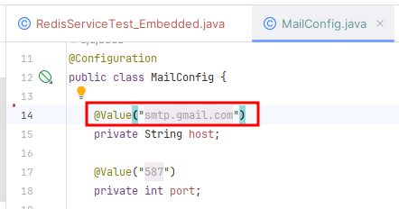
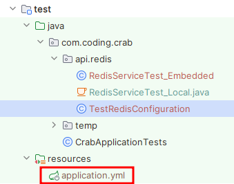
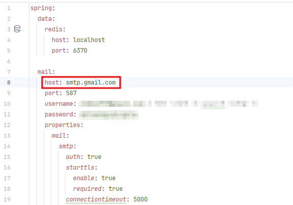

# Could not resolve placeholder ... 에러

Spring에서 `application.properties`와 같은 **외부 설정 파일**로부터 설정값을 읽어옵니다. 

이때 해당 값을 제대로 읽어오지 못한 경우 `Could not resolve placeholder ...` 에러가 발생할 수 있습니다.

## 에러 원인 파헤치기

### 1. 에러 로그 분석
```java
org.springframework.beans.factory.BeanCreationException: Error creating bean with name 'mailConfiguration': Injection of autowired dependencies failed
	at org.springframework.beans.factory.annotation.AutowiredAnnotationBeanPostProcessor.postProcessProperties(AutowiredAnnotationBeanPostProcessor.java:514) ~[spring-beans-6.1.2.jar:6.1.2]
	at org.springframework.beans.factory.support.AbstractAutowireCapableBeanFactory.populateBean(AbstractAutowireCapableBeanFactory.java:1418) ~[spring-beans-6.1.2.jar:6.1.2]
        ...
        (중략)
        ...
Caused by: java.lang.IllegalArgumentException: Could not resolve placeholder 'spring.mail.host' in value "${spring.mail.host}"
	at org.springframework.util.PropertyPlaceholderHelper.parseStringValue(PropertyPlaceholderHelper.java:180) ~[spring-core-6.1.2.jar:6.1.2]
	at org.springframework.util.PropertyPlaceholderHelper.replacePlaceholders(PropertyPlaceholderHelper.java:126) ~[spring-core-6.1.2.jar:6.1.2]
	... 94 common frames omitted
```

#### (1) `Error creating bean with name 'mailConfiguration': Injection of autowired dependencies failed`
MailConfiguration 이라는 Bean 생성을 하지 못해 의존성 주입에 실패했다고 합니다.

#### (2) `Could not resolve placeholder 'spring.mail.host' in value "${spring.mail.host}"`
조금 더 아래로 내려보니 Bean 생성을 못한 이유가 나와있었습니다. `spring.mail.host`에 적힌 설정값을 찾을 수 없다는 뜻입니다.



### 2. 상황 분석
스프링 부트 앱 실행에는 전혀 문제가 없었지만, 꼭 테스트 코드를 실행할 때만 위 에러가 발생하단 걸 알아냈습니다.

이를 토대로 Embedded Redis Server를 사용하기 위해 테스트 환경용 설정 파일 `src/test/resources/application.yml`을 새로 추가한 게 문제란 걸 깨달았습니다.



#### application.yml
여기에는 `spring.mail.host`값이 정의되지 않았고, 그래서 `Could not resolve placeholder ...` 에러가 뜬 것이었습니다.


## 해결
`main`과 똑같이 `test`에도 필요한 설정값을 넣어주니 에러가 해결되었습니다.


## 복기
아무래도 **설정 파일**과 **실행 환경**에 대한 이해가 부족해서 생긴 휴먼 에러인 것 같습니다.
- 기존에는 `src/main`에만 `yml`이 있었기 때문에 테스트 환경에서도 문제가 없었습니다.
- 그러나 `src/test`에 `yml`을 새로 추가하니 테스트시엔 `main`이 아닌 `test`의 `yml`을 우선적으로 적용하게 되었고, 이로 인해 생긴 사소한(?) 에러였던 것입니다.

## Reference
- Spring properties 사용시 UnsatisfiedDependencyException: Could not resolve placeholder 오류 조치 https://oingdaddy.tistory.com/235
- Spring Boot 테스트 실행환경 분리하기 https://velog.io/@wltn716/Spring-Boot-%ED%85%8C%EC%8A%A4%ED%8A%B8-%EC%8B%A4%ED%96%89%ED%99%98%EA%B2%BD-%EB%B6%84%EB%A6%AC%ED%95%98%EA%B8%B0
- Spring Boot 환경 분리하기 https://velog.io/@stbpiza/Spring-Boot-%ED%99%98%EA%B2%BD-%EB%B6%84%EB%A6%AC%ED%95%98%EA%B8%B0